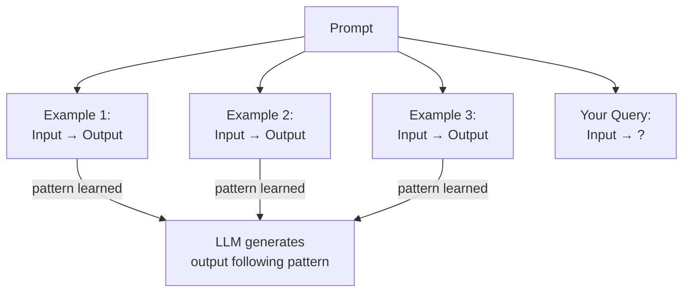
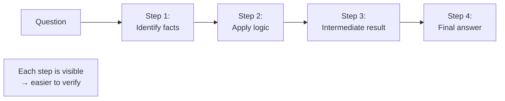

# Prompting Techniques

## Why Prompting Matters

Garbage in, garbage out. The LLM's output quality is directly determined by the input quality. Prompting is the interface between your application logic and the model. For agents, prompting is not about writing clever one-liners. It is about constructing inputs that reliably produce structured, actionable outputs.

## Zero-Shot Prompting

Ask directly, no examples.

```python
response = client.chat.completions.create(
    model="gpt-4o",
    messages=[{
        "role": "user",
        "content": "Classify this sentiment: 'The food was amazing but service was slow.'"
    }]
)
```

Works for simple tasks. Fails for tasks where the model needs to understand the expected format or reasoning pattern.

## Few-Shot Prompting

Provide examples to demonstrate the pattern.

```python
messages = [
    {"role": "user", "content": "Classify: 'Great product!' -> positive"},
    {"role": "assistant", "content": "positive"},
    {"role": "user", "content": "Classify: 'Terrible experience.' -> negative"},
    {"role": "assistant", "content": "negative"},
    {"role": "user", "content": "Classify: 'The food was amazing but service was slow.' ->"},
]

response = client.chat.completions.create(model="gpt-4o", messages=messages)
```

Examples teach the model the pattern. Use 2-5 examples. More examples improve consistency but consume tokens. Each example costs money and reduces available context.



## Chain-of-Thought

Ask the model to reason step-by-step before answering.

```python
prompt = """
Solve this step by step.

Question: A store had 23 apples. They sold 15 and received a delivery of 8. How many apples do they have?

Think through this:
1) Start with 23
2) Subtract 15 sold: 23 - 15 = 8
3) Add 8 delivered: 8 + 8 = 16
Answer: 16
"""

prompt_two = """
Question: A baker made 48 muffins. 12 were blueberry, the rest were chocolate chip.
He sold half the chocolate chip muffins. How many muffins remain?

Solve step by step.
"""
```

Chain-of-thought improves accuracy on reasoning tasks significantly. For agents, this is not optional. When the agent needs to decide which tool to use or whether a task is complete, asking the model to reason first produces better decisions.

The key insight: the model's output quality depends on the reasoning visible in the output. Intermediate reasoning steps improve final answer quality because the model is essentially doing more computation per answer.



## Structured Output

Force the model to respond in a specific format.

```python
import json
from pydantic import BaseModel

class Classification(BaseModel):
    sentiment: str
    confidence: float
    reasoning: str

response = client.chat.completions.create(
    model="gpt-4o",
    messages=[{
        "role": "user",
        "content": """Classify this review. Respond in JSON:
        {"sentiment": "positive|negative|mixed", "confidence": 0.0-1.0, "reasoning": "why"}

        Review: 'The food was amazing but service was slow.'"""
    }]
)

result = Classification(**json.loads(response.choices[0].message.content))
print(result.sentiment)   # "mixed"
print(result.confidence)  # 0.85
```

For agents, structured output is non-negotiable. Tools need structured arguments. Downstream code needs parseable responses. Use JSON mode or function calling (covered in [03-structured-outputs](../02-building-agents/03-structured-outputs.md)).

## Prompting for Agents

In agent systems, the "prompt" is the system message plus the conversation history plus the available tools. The model does not just read your prompt. It reads everything in the messages array and the tool schemas.

Prompt engineering for agents means:
1. **Clear system instructions** that define the agent's role, constraints, and decision criteria
2. **Well-described tools** that the model can understand and choose between
3. **Managed conversation history** that provides relevant context without exceeding the context window

A bad prompt in an agent system does not just produce a bad response. It causes the agent to call the wrong tool, skip a step, or hallucinate a result. Prompt quality directly affects agent reliability.
