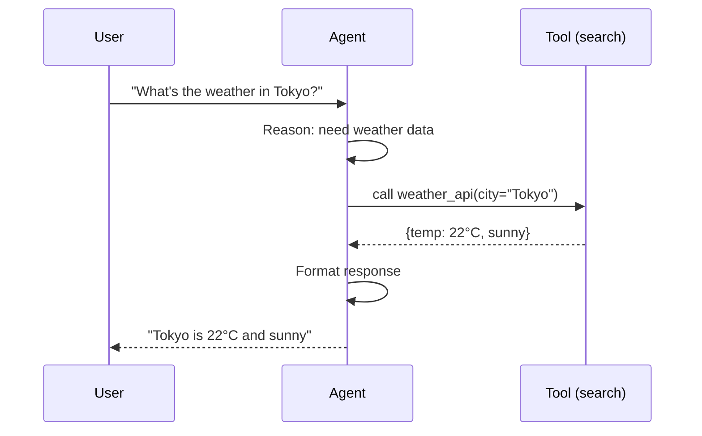

# Tools and Functions

## What Are Tools

Tools are functions the agent can call to interact with the world. Think of them as APIs for the LLM. The agent decides when to call a tool, which tool to call, and what arguments to pass. You define the tools. The model decides how to use them.

## Tool Schema Definition

Every tool needs a schema that tells the LLM what it does and what parameters it accepts. This is an API contract.



```python
tools = [
    {
        "type": "function",
        "function": {
            "name": "search_web",
            "description": "Search the web for information. Returns top results with titles, URLs, and snippets. Use this when you need current information that may not be in your training data.",
            "parameters": {
                "type": "object",
                "properties": {
                    "query": {
                        "type": "string",
                        "description": "The search query. Be specific for better results."
                    },
                    "num_results": {
                        "type": "integer",
                        "description": "Number of results to return. Default 5.",
                        "default": 5
                    }
                },
                "required": ["query"]
            }
        }
    },
    {
        "type": "function",
        "function": {
            "name": "calculate",
            "description": "Evaluate a mathematical expression. Use this for any arithmetic, algebra, or statistical calculation. Do not attempt math in your head.",
            "parameters": {
                "type": "object",
                "properties": {
                    "expression": {
                        "type": "string",
                        "description": "The mathematical expression to evaluate, e.g. '(23 * 1.08) + 15'"
                    }
                },
                "required": ["expression"]
            }
        }
    }
]
```

## Tool Description Best Practices

The `description` field is the most important part of tool design. The model reads it to decide when and how to use the tool.

Bad description: `"Searches things."` -- The model does not know when to use this vs. other tools.

Good description: `"Search the web for current information. Use when the user asks about recent events, current data, or topics that may have changed since your training cutoff."` -- The model knows exactly when this tool is appropriate.

Rules:
1. State what the tool does in plain language.
2. State when to use it (and when not to).
3. Be specific about parameter formats and constraints.
4. Include examples of valid inputs if the format is non-obvious.

## Tool Implementation

The schema tells the LLM about the tool. The implementation actually executes it.

```python
import requests

def search_web(query: str, num_results: int = 5) -> str:
    """Execute a web search and return formatted results."""
    try:
        response = requests.get(
            "https://api.search.example.com/search",
            params={"q": query, "num": num_results},
            timeout=10
        )
        response.raise_for_status()
        results = response.json().get("results", [])

        if not results:
            return "No results found."

        formatted = []
        for r in results[:num_results]:
            formatted.append(f"- {r['title']}: {r['snippet']} ({r['url']})")
        return "\n".join(formatted)

    except requests.RequestException as e:
        return f"Search failed: {str(e)}"

def calculate(expression: str) -> str:
    """Safely evaluate a mathematical expression."""
    import ast
    import operator

    ops = {
        ast.Add: operator.add, ast.Sub: operator.sub,
        ast.Mult: operator.mul, ast.Div: operator.truediv,
        ast.Pow: operator.pow, ast.USub: operator.neg,
    }

    try:
        node = ast.parse(expression, mode='eval')
        def eval_node(n):
            if isinstance(n, ast.Constant):
                return n.value
            if isinstance(n, ast.BinOp):
                return ops[type(n.op)](eval_node(n.left), eval_node(n.right))
            if isinstance(n, ast.UnaryOp):
                return ops[type(n.op)](eval_node(n.operand))
            raise ValueError(f"Unsupported operation: {type(n)}")
        return str(eval_node(node.body))
    except Exception as e:
        return f"Calculation error: {str(e)}"

TOOL_MAP = {
    "search_web": search_web,
    "calculate": calculate,
}

def execute_tool(name: str, args: dict) -> str:
    tool_fn = TOOL_MAP.get(name)
    if not tool_fn:
        return f"Unknown tool: {name}"
    return tool_fn(**args)
```

## Who Decides When to Use a Tool

The LLM decides. Not you. You provide tools and their schemas. The model reads the user message, the conversation history, and the tool schemas, then decides whether to call a tool and which one. This is the core of agent autonomy.

The model might:
- Call a tool immediately (user asks a factual question, model calls search)
- Call multiple tools in sequence (search, then calculate with the search result)
- Not call any tools (the question can be answered from training data)
- Call the wrong tool (this is a failure mode -- mitigate with good descriptions)

## Error Handling in Tools

Tools fail. The network goes down. APIs return errors. The agent must handle this gracefully.

Return error messages as tool results (strings). The LLM reads the error and decides what to do: retry with different parameters, try a different tool, or inform the user.

Never raise exceptions from tools into the agent loop. Catch all errors and return descriptive error strings. The model is surprisingly good at recovering from errors if it can read what went wrong.
