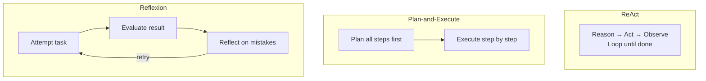

# Planning

## When to Plan vs When to React

Not every task needs a plan. Simple tasks (single tool call, direct answer) work fine with reactive execution: the LLM sees the input and acts. Complex tasks (multiple dependent steps, conditional logic, backtracking) benefit from explicit planning.



Rule of thumb: if the task requires more than 3 sequential tool calls with dependencies between them, plan first.

## ReAct (Reactive)

The agent reacts to each observation without a predefined plan. The LLM decides the next step based on the current context. Good for simple tasks where the path is obvious.

```python
# ReAct flow: interleaved reasoning and action
# No upfront plan. The agent figures it out as it goes.
"""
User: "What's the weather in Tokyo and should I bring an umbrella?"

Agent (thinking): I need the current weather in Tokyo.
Action: call get_weather("Tokyo")
Result: "Tokyo: 18C, 85% humidity, 60% chance of rain"

Agent (thinking): 60% chance of rain. Yes, bring an umbrella.
Response: "It's 18C with a 60% chance of rain. Bring an umbrella."
"""
```

Works well for: simple lookups, single-step reasoning, straightforward Q&A.

## Plan-and-Execute

The agent creates a plan first, then executes each step. The plan can be revised if a step fails.

```python
from pydantic import BaseModel

class PlanStep(BaseModel):
    step: int
    action: str
    tool: str | None = None
    depends_on: list[int] = []

class Plan(BaseModel):
    goal: str
    steps: list[PlanStep]

def create_plan(user_task: str, available_tools: list[str]) -> Plan:
    response = client.chat.completions.create(
        model="gpt-4o",
        response_format={"type": "json_object"},
        messages=[
            {"role": "system", "content": f"""You are a planning agent.
Available tools: {available_tools}
Create a step-by-step plan. Return JSON with:
{{"goal": "...", "steps": [{{"step": 1, "action": "...", "tool": "...", "depends_on": []}}]}}
Only include steps that require tools or complex reasoning."""},
            {"role": "user", "content": user_task},
        ]
    )
    return Plan.model_validate_json(response.choices[0].message.content)

def execute_plan(plan: Plan, tool_map: dict) -> dict:
    results = {}
    for step in plan.steps:
        # Check dependencies
        for dep in step.depends_on:
            if dep not in results:
                results[dep] = execute_plan_step(dep, plan, results, tool_map)

        if step.tool and step.tool in tool_map:
            results[step.step] = tool_map[step.tool]()
        else:
            results[step.step] = f"Completed: {step.action}"

    return results
```

Works well for: research tasks, data pipelines, multi-step workflows with known dependencies.

## Reflexion

The agent critiques its own output and revises it. This adds a self-evaluation step after execution.

```python
def reflexion_agent(task: str, max_revisions: int = 3) -> str:
    # Generate initial response
    response = call_llm(f"Complete this task: {task}")

    for i in range(max_revisions):
        # Self-critique
        critique = call_llm(f"""You are a quality reviewer. Critique this response:

Task: {task}
Response: {response}

Identify specific issues: missing information, logical errors,
unsupported claims, or incomplete analysis. Be specific.""")

        if "no issues" in critique.lower() or "looks good" in critique.lower():
            break

        # Revise based on critique
        response = call_llm(f"""Revise your response based on this critique:

Original task: {task}
Your previous response: {response}
Critique: {critique}

Provide an improved response that addresses all identified issues.""")

    return response
```

Works well for: writing tasks, analysis that requires accuracy, any task where quality matters more than speed.

## Choosing a Planning Strategy

| Strategy | Cost | Latency | Quality | When to Use |
|----------|------|---------|---------|-------------|
| ReAct | Low | Low | Variable | Simple tasks, < 3 steps |
| Plan-and-Execute | Medium | Medium | Consistent | Structured multi-step tasks |
| Reflexion | High | High | High | Quality-critical tasks, writing |

Cost and latency increase with planning complexity because each step requires an LLM call. Do not over-engineer. Use ReAct by default. Add planning when tasks get complex. Add reflexion when quality is critical.
