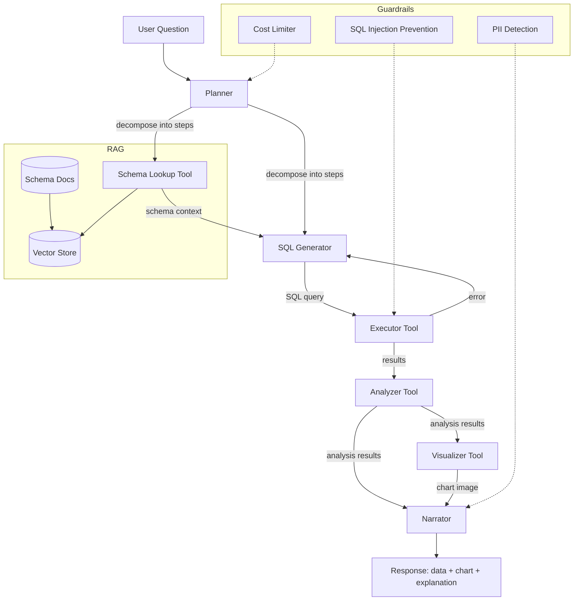
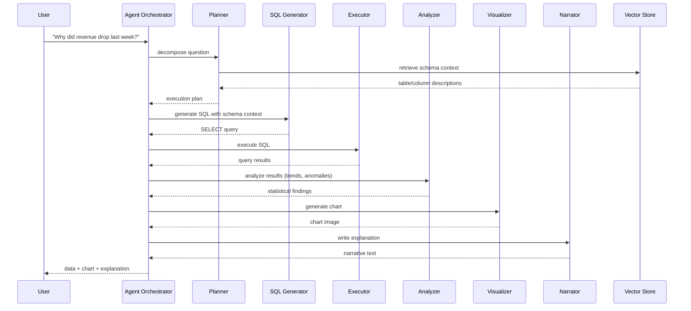

# Capstone: Data Analyst Agent

> Build an AI agent that answers business questions in natural language by querying databases, running analysis, generating charts, and writing narrative explanations.

**Roadmap:** ai-agent-developer (Python + LLM API)
**Architecture:** Multi-tool agent system with RAG
**Challenge Repo:** https://github.com/TP-Coder-Innovation-Hub/data-analysis-research-agent-challenge
**Frontend:** Vue 3 chat interface

---

## Business Context

Every company wants to "ask their data" a question and get an answer. Analysts write SQL, build charts, and write reports -- this process takes hours. A data analyst agent collapses that to seconds. A business user types "Why did revenue drop last week?" and gets back data, a chart, and a written explanation. This capstone builds that product.

---

## Learning Objectives

By completing this capstone you will demonstrate ability to:

1. **Agent Architecture** -- Design a multi-step agent with planning, tool use, and orchestration
2. **Tool Use** -- Implement tools (SQL execution, schema lookup, chart generation, statistical analysis, fact checking) that the LLM calls autonomously
3. **RAG** -- Build a retrieval-augmented generation pipeline using vector store (ChromaDB or FAISS) with database schema documents
4. **Guardrails** -- Implement safety layers (PII detection, cost limits, SQL injection prevention)
5. **Evaluation** -- Measure agent performance (accuracy, SQL validity, cost, latency, guardrail effectiveness)
6. **LLM Integration** -- Work with an LLM API (OpenAI, Anthropic, or local model) for reasoning, generation, and function calling

---

## Architecture





### Agent Components

| Component | Responsibility |
|---|---|
| **Planner** | Decomposes question into steps: which tables, what analysis, what visualization |
| **SQL Generator** | Generates SQL using LLM + schema context from RAG |
| **Executor** | Runs SQL against PostgreSQL, catches errors, retries with corrected SQL |
| **Analyzer** | Statistical analysis -- trends, correlations, anomalies |
| **Visualizer** | Generates charts (bar, line, pie) using matplotlib or plotly |
| **Narrator** | Writes natural language summary of findings |
| **Guardrails** | PII detection, cost limits (max tokens per query), SQL injection prevention |

### Agent Tools

| Tool | Signature | Description |
|---|---|---|
| `database_query` | `(sql: str) -> list[dict]` | Execute SQL on PostgreSQL |
| `schema_lookup` | `(table_name: str) -> str` | Retrieve table/column descriptions |
| `chart_generator` | `(data: list[dict], chart_type: str, title: str) -> str` | Create visualization, return image path |
| `statistical_analysis` | `(data: list[dict], method: str) -> dict` | Compute trends, correlations, anomalies |
| `fact_checker` | `(sql: str, expected_columns: list[str]) -> bool` | Verify generated SQL returns expected column types |

---

## Feature Requirements

### 1. Natural Language Question Parsing

The agent accepts free-text business questions and extracts structured intent.

**Acceptance Criteria:**
- [ ] Accepts natural language input via API endpoint
- [ ] Extracts intent (trend analysis, comparison, aggregation, anomaly detection)
- [ ] Identifies time ranges from relative expressions ("last week", "past 30 days")
- [ ] Identifies relevant business entities (revenue, customers, products, regions)
- [ ] Returns a structured execution plan to downstream components

### 2. SQL Generation + Execution

The agent generates SQL from natural language using schema context and executes it with error recovery.

**Acceptance Criteria:**
- [ ] Generates valid PostgreSQL SQL from structured intent
- [ ] Uses RAG-retrieved schema context to inform SQL generation
- [ ] Executes SQL and returns structured results
- [ ] On SQL error, feeds error message back to LLM and regenerates (max 3 retries)
- [ ] Logs all generated SQL for audit
- [ ] Blocks `DROP`, `DELETE`, `UPDATE`, `INSERT`, `ALTER`, `TRUNCATE` statements

### 3. Statistical Analysis

The agent performs statistical computations on query results.

**Acceptance Criteria:**
- [ ] Detects trends (increasing, decreasing, flat) over time series data
- [ ] Identifies anomalies (values outside 2 standard deviations)
- [ ] Computes correlations between metrics
- [ ] Calculates period-over-period changes (e.g., week-over-week)
- [ ] Returns structured analysis results for the narrator

### 4. Chart Generation

The agent creates visualizations from data.

**Acceptance Criteria:**
- [ ] Generates bar charts for comparisons
- [ ] Generates line charts for trends over time
- [ ] Generates pie charts for distributions
- [ ] Returns charts as PNG images (saved to disk, path returned to frontend)
- [ ] Auto-selects chart type based on data characteristics when user does not specify

### 5. Narrative Response Generation

The agent writes a human-readable explanation of findings.

**Acceptance Criteria:**
- [ ] Generates a 2-4 paragraph explanation referencing specific data points
- [ ] Includes computed metrics (percentages, dollar amounts, counts)
- [ ] References the chart by describing what it shows
- [ ] Avoids hallucinated data -- every number in the narrative must come from query results
- [ ] Strips or masks PII before including in narrative (see Guardrails)

### 6. Guardrails

The agent includes safety and cost controls.

**Acceptance Criteria:**
- [ ] **PII Detection:** Scans query results for email addresses, phone numbers, SSNs, credit card numbers and masks them before returning to user
- [ ] **Cost Limits:** Enforces max token limit per query (configurable, default 4000 tokens). Rejects or truncates requests exceeding limit
- [ ] **SQL Injection Prevention:** Parameterizes queries where possible. Blocks multi-statement execution. Blocks DDL/DML statements. Validates table/column names against schema
- [ ] **Guardrail violations are logged with severity level**

### 7. Evaluation Suite

The project includes automated evaluation of agent performance.

**Acceptance Criteria:**
- [ ] **Answer Accuracy:** Test set of 20+ questions with known correct answers. Measure if SQL returns correct data (compare against hand-written SQL)
- [ ] **SQL Validity:** Percentage of generated SQL that executes without errors (target: >90%)
- [ ] **Cost Efficiency:** Track tokens consumed per query. Report average, p50, p95
- [ ] **Latency:** Measure end-to-end time from question to answer. Report average, p50, p95
- [ ] **Guardrail Effectiveness:** Test suite of 10+ adversarial inputs (PII extraction attempts, SQL injection, excessive token usage). Measure block rate (target: 100%)
- [ ] Results output as a JSON report

---

## Tech Constraints

| Constraint | Requirement |
|---|---|
| Language | Python 3.11+ |
| LLM API | OpenAI, Anthropic, or local model via API |
| Database | PostgreSQL 15+ |
| Vector Store | ChromaDB or FAISS |
| Chart Library | matplotlib or plotly |
| Frontend | Vue 3 (chat interface, renders charts, shows SQL + data tables) |
| Agent Tools | Minimum 3 tools the agent can call |
| RAG | Required -- schema docs, column descriptions, sample queries in vector store |
| Guardrails | Required -- PII, cost limits, SQL injection prevention |
| Evaluation | Required -- accuracy, validity, cost, latency, guardrail metrics |
| Containerization | Docker Compose (app + PostgreSQL + vector store) |
| Seed Data | Seeded database with realistic business data (sales, customers, products, regions) |

---

## Architecture Decision Records

### ADR-001: Tool-based architecture over monolithic LLM calls

**Context:** The agent needs to execute SQL, generate charts, run analysis, and write narratives.

**Decision:** Implement discrete tools the LLM calls via function calling, rather than having the LLM do everything in a single prompt.

**Rationale:** Tools are testable in isolation, replaceable, and allow the LLM to reason about when to use each capability. Monolithic prompts lack composability and are harder to debug.

### ADR-002: RAG for schema context instead of full schema in prompt

**Context:** The LLM needs database schema knowledge to generate correct SQL.

**Decision:** Store schema docs in a vector store and retrieve relevant tables/columns per question, rather than embedding the full schema in every prompt.

**Rationale:** A full schema in the prompt wastes tokens and may exceed context limits as the database grows. RAG retrieves only relevant context, reducing cost and improving SQL accuracy.

### ADR-003: Retry loop for SQL errors instead of pre-validation

**Context:** Generated SQL may contain syntax errors or reference non-existent columns.

**Decision:** Execute SQL, catch errors, feed the error message back to the LLM, and retry (max 3 attempts). Do not attempt to validate SQL before execution.

**Rationale:** Pre-validating SQL is complex and unreliable. PostgreSQL is the source of truth for what is valid. Error messages are precise and give the LLM exactly what it needs to fix the query.

### ADR-004: PostgreSQL as the sole data source

**Context:** The agent needs a structured data source for business queries.

**Decision:** Use a single PostgreSQL database with seeded realistic data. No external APIs or file-based data sources.

**Rationale:** A single database simplifies the architecture, makes the RAG pipeline focused, and ensures deterministic evaluation. Seed data provides a controlled environment for testing.

### ADR-005: Separate Vue 3 frontend from Python backend

**Context:** The user needs an interface to interact with the agent.

**Decision:** Build a Vue 3 chat-style frontend that communicates with the Python backend via REST API. The backend returns structured JSON (narrative, data, chart path, SQL).

**Rationale:** Separation of concerns. The Python backend owns agent logic, LLM calls, and database access. The frontend owns rendering, chart display, and user interaction.

---

## Seed Data Requirements

The PostgreSQL database must include:

| Table | Rows | Key Columns |
|---|---|---|
| `customers` | 500+ | id, name, email, region, signup_date |
| `products` | 50+ | id, name, category, price |
| `orders` | 5,000+ | id, customer_id, order_date, total_amount, status |
| `order_items` | 15,000+ | id, order_id, product_id, quantity, unit_price |
| `regions` | 10+ | id, name, country |

Data must span at least 12 months to enable trend analysis.

---

## Project Structure

```
data-analysis-research-agent/
├── docker-compose.yml
├── Dockerfile
├── requirements.txt
├── seed/
│   ├── schema.sql
│   └── seed_data.sql
├── src/
│   ├── main.py
│   ├── agent/
│   │   ├── orchestrator.py
│   │   ├── planner.py
│   │   ├── sql_generator.py
│   │   ├── narrator.py
│   │   └── guardrails.py
│   ├── tools/
│   │   ├── database_query.py
│   │   ├── schema_lookup.py
│   │   ├── chart_generator.py
│   │   ├── statistical_analysis.py
│   │   └── fact_checker.py
│   ├── rag/
│   │   ├── indexer.py
│   │   └── retriever.py
│   └── api/
│       └── routes.py
├── frontend/
│   ├── package.json
│   └── src/
│       ├── App.vue
│       ├── components/
│       │   ├── ChatInterface.vue
│       │   ├── ChartDisplay.vue
│       │   ├── DataTable.vue
│       │   └── SqlPreview.vue
│       └── ...
├── eval/
│   ├── test_questions.json
│   ├── run_evaluation.py
│   └── adversarial_inputs.json
└── README.md
```

---

## Submission Checklist

- [ ] Agent answers natural language questions with data + chart + explanation
- [ ] SQL generation works with error recovery (retry on failure)
- [ ] Statistical analysis produces trend, anomaly, and correlation results
- [ ] Charts generated as images (bar, line, pie)
- [ ] Narrative response references actual data points (no hallucinated numbers)
- [ ] PII detection masks sensitive data in responses
- [ ] Cost limits enforced (configurable max tokens)
- [ ] SQL injection prevention blocks DDL/DML and multi-statement queries
- [ ] RAG pipeline indexes schema docs and retrieves context per question
- [ ] Evaluation suite runs and produces JSON report (accuracy, validity, cost, latency, guardrails)
- [ ] Docker Compose starts all services (app, PostgreSQL, vector store)
- [ ] Database seeded with realistic data (customers, products, orders, order_items, regions)
- [ ] Vue 3 frontend renders chat, charts, SQL preview, and data tables
- [ ] README includes setup instructions, architecture overview, and evaluation results
