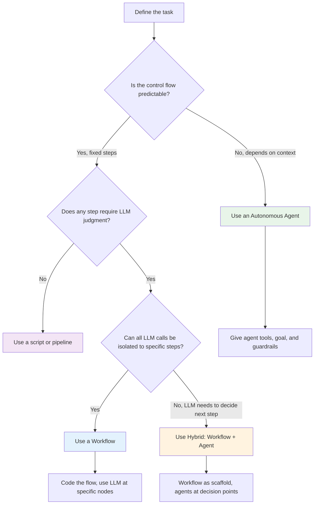
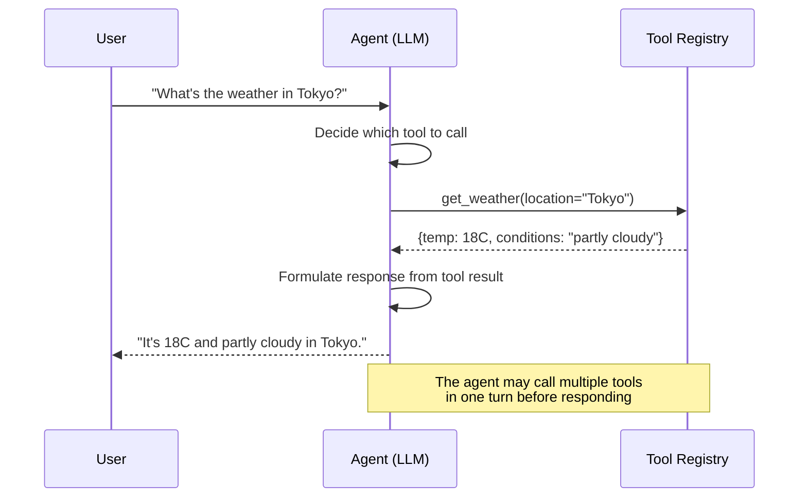
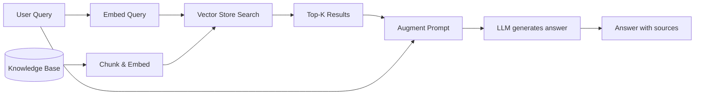

# AI Agent Developer Fundamentals

> A comprehensive guide for software engineers entering the AI agent ecosystem in 2026.
> From foundational concepts to production-grade multi-agent systems.

---

## Table of Contents

1. [The AI Agent Landscape in 2026](#1-the-ai-agent-landscape-in-2026)
2. [Agent Architecture: When Agents vs Workflows](#2-agent-architecture-when-agents-vs-workflows)
3. [How LLMs Actually Work (for Engineers)](#3-how-llms-actually-work-for-engineers)
4. [Tool Use & Function Calling](#4-tool-use--function-calling)
5. [RAG: Retrieval-Augmented Generation](#5-rag-retrieval-augmented-generation)
6. [Multi-Agent Systems](#6-multi-agent-systems)
7. [Protocols & Standards: MCP, A2A](#7-protocols--standards-mcp-a2a)
8. [Production Patterns](#8-production-patterns)
9. [What's Next](#9-whats-next)

---

## 1. The AI Agent Landscape in 2026

`[Entry]`

Something fundamental shifted between 2024 and 2026. Large Language Models stopped being the product and became infrastructure. The chatbot era -- where the apex of AI application was a text box that answered questions -- gave way to something far more consequential: **agents**.

An AI agent is a system that uses an LLM as its reasoning engine to autonomously decide which actions to take, which tools to invoke, and how to respond -- all in pursuit of a goal provided by a human. If LLMs are the CPU, agents are the operating system.

Three developments made this transition possible:

**Structured outputs became reliable.** Early LLMs returned freeform text. You could ask for JSON, but you would get it wrapped in markdown, missing fields, or with invented keys. By 2025, all major providers -- OpenAI, Anthropic, Google -- shipped native structured output modes. You define a schema; the model guarantees compliance. This turned LLMs from conversation partners into **programmable components**.

**MCP (Model Context Protocol) standardized tool interfaces.** Before MCP, every framework invented its own way of describing tools to LLMs. LangChain had `@tool` decorators, OpenAI had function calling schemas, Anthropic had its own format. MCP introduced a universal, protocol-level standard for how agents discover, describe, and invoke tools. Think of it as HTTP for agent-tool interaction. A tool written once works with any MCP-compatible agent, regardless of framework or provider.

**A2A (Agent-to-Agent) enabled multi-agent collaboration.** Single agents are limited by their context window, their training data, and their reasoning capacity. A2A defines how agents advertise their capabilities to other agents, negotiate tasks, and exchange results. This is the protocol layer that makes multi-agent systems interoperable -- not just within one framework, but across vendors and runtimes.

### Why This Matters for Software Engineers

You do not need to be a machine learning researcher to build AI agents. The skills that transfer directly:

- **API design** -- tool interfaces are APIs. The same principles of clear contracts, versioning, and error handling apply.
- **State management** -- agents maintain state across turns. If you have built stateful web applications, you already understand the challenges.
- **Systems thinking** -- deciding when to use an agent vs a workflow is an architecture decision, not an AI decision.
- **Testing and observability** -- agents are nondeterministic. Testing them requires new patterns, but the discipline of observability translates directly.

The rest of this guide will give you the conceptual foundations and practical patterns to start building. You will not find hype here. You will find engineering.

---

## 2. Agent Architecture: When Agents vs Workflows

`[Entry]` `[Mid]`

> Reference: Anthropic, "Building Effective Agents" (2025). The framework below adapts and extends that work.

The single most important architectural decision you will make is: **should this task be handled by an autonomous agent, an orchestrated workflow, or something in between?**

This is not a question about AI sophistication. It is a question about task characteristics.

### Definitions

**Autonomous Agent.** The LLM decides what to do next at each step. You give it a goal, a set of tools, and a stopping condition. It loops: think, act, observe, repeat. The agent controls its own control flow.

**Workflow (Orchestrated).** You, the developer, define the control flow in code. Step 1 calls tool A, step 2 calls the LLM to classify, step 3 branches based on that classification. The LLM is a component within your pipeline, not the controller.

**Hybrid.** A workflow where one or more steps delegate to autonomous agents. For example, a workflow that retrieves data, then hands off to an agent for open-ended analysis, then routes the result through a validation pipeline.

### Decision Flowchart



### When to Use Each

| Pattern | Use When | Example |
|---------|----------|---------|
| Script | Deterministic steps, no LLM needed | ETL pipeline, data transformation |
| Workflow | Predictable flow, LLM at specific steps | Document processing: extract, classify, route |
| Hybrid | Mostly predictable, but some open-ended steps | Customer support: triage workflow, then agent for complex cases |
| Autonomous Agent | Unpredictable, multi-step, requires judgment | Research assistant, code debugging, open-ended analysis |

### The Practical Implication

Agents are more flexible but harder to test, more expensive (more LLM calls), and less predictable. Workflows are rigid but reliable, testable, and cost-efficient. **Start with a workflow. Add agent autonomy only where you can justify it.** Most production systems end up as hybrids.

---

## 3. How LLMs Actually Work (for Engineers)

`[Entry]`

You do not need to understand transformer attention mechanisms to build agents. You do need to understand the operational model -- how input becomes output, what the constraints are, and where the failure modes live.

### Tokens, Not Text

LLMs do not process text. They process **tokens** -- subword units that the model's tokenizer splits input into. "Hello world" might be three tokens: `["Hel", "lo", " world"]`. Tokenization varies by model. GPT-family models and Claude use different tokenizers, so the same string can have different token counts.

Why this matters:

- **Pricing** is per token. Knowing your token budget is like knowing your memory budget.
- **Context windows** are measured in tokens. Claude has a 200K token context. GPT-4o supports 128K. Gemini reaches 1M+. But "supports" does not mean "uses well" -- performance degrades with context length.
- **Rate limits** are often expressed in tokens per minute.

```python
import tiktoken

enc = tiktoken.encoding_for_model("gpt-4o")
text = "Define a tool that searches the company knowledge base."
tokens = enc.encode(text)
print(f"Token count: {len(tokens)}")
print(f"Tokens: {tokens}")
# Token count: 10
# Tokens: [58910, 264, 3414, 430, 13168, 279, 1981, 7438, 5882, 13]
```

### The Context Window

Think of the context window as the LLM's working memory. Everything the model can reference -- system prompt, conversation history, tool definitions, retrieved documents -- must fit within it.

```
+---------------------------------------------------+
|                  Context Window (e.g., 200K tokens) |
+---------------------------------------------------+
| System Prompt        | ~500 tokens                  |
| Tool Definitions     | ~2,000 tokens                |
| Conversation History | ~5,000 tokens                |
| Retrieved Documents  | ~10,000 tokens               |
| Reserved for Output  | ~4,000 tokens                |
+---------------------------------------------------+
```

When the context window fills up, you must manage it: truncate history, summarize earlier turns, or prune retrieved documents. This is a systems engineering problem, not an AI problem.

### Temperature and Sampling

**Temperature** controls the randomness of output. At temperature 0, the model always picks the most probable next token (deterministic). At temperature 1, it samples according to the probability distribution.

For agent workloads:
- **Tool selection, classification, structured extraction:** temperature 0. You want reliability, not creativity.
- **Content generation, brainstorming:** temperature 0.3-0.7.
- **Creative writing, ideation:** temperature 0.7-1.0.

**Top-p** (nucleus sampling) is another sampling parameter that restricts sampling to the most probable tokens whose cumulative probability exceeds p. For most agent tasks, set temperature and leave top-p at default.

### System Prompts

The system prompt is the highest-priority instruction. It sets the agent's behavior, persona, constraints, and decision-making framework. For agents, the system prompt typically includes:

1. **Role definition** -- who the agent is and what it does
2. **Available tools** -- what actions the agent can take
3. **Decision criteria** -- when to use which tool
4. **Constraints** -- what the agent must not do
5. **Output format** -- how to structure responses

```python
SYSTEM_PROMPT = """You are a data analysis agent for a SaaS platform.

Your available tools:
- query_database: Run SQL against the analytics warehouse
- search_docs: Search internal documentation
- calculate: Perform mathematical computations

Decision rules:
- If the user asks about metrics, use query_database
- If the user asks about definitions or policies, use search_docs
- If you need to compute ratios, percentages, or projections, use calculate
- Always validate query results before presenting them

Output format:
- Lead with the direct answer
- Show your reasoning in a collapsible section
- Include data sources used
"""
```

### Chat Completions: The Core Loop

The fundamental API for all LLM interactions is the chat completion. You send a list of messages (system, user, assistant, tool results), and the model returns the next message.

```python
from openai import OpenAI

client = OpenAI()

response = client.chat.completions.create(
    model="gpt-4o",
    messages=[
        {"role": "system", "content": SYSTEM_PROMPT},
        {"role": "user", "content": "What was our MRR growth rate last quarter?"},
    ],
    temperature=0,
)
print(response.choices[0].message.content)
```

For agents, this loop repeats: the assistant response may contain a tool call, you execute the tool, you send the result back, and the model responds again. The next section covers this in detail.

---

## 4. Tool Use & Function Calling

`[Mid]`

Tool use is what makes an LLM an agent. Without tools, an LLM can only generate text. With tools, it can take actions in the world -- query databases, call APIs, write files, send messages.

### How Tool Calling Works

The agent-tool interaction follows a loop:



1. The developer defines tools with JSON schemas describing their parameters.
2. The LLM receives the tool definitions as part of its context.
3. When the user's request requires external action, the LLM outputs a structured tool call (tool name + arguments) instead of a text response.
4. The agent runtime (your code) parses the tool call, executes it, and sends the result back to the LLM.
5. The LLM uses the result to formulate its response or decide on the next action.

### Defining Tools

A tool definition has three parts: a name, a description, and a parameter schema.

```python
tools = [
    {
        "type": "function",
        "function": {
            "name": "search_knowledge_base",
            "description": (
                "Search the company knowledge base for relevant documents. "
                "Use this when the user asks about company policies, procedures, "
                "product documentation, or historical decisions. Returns up to "
                "5 matching document snippets ranked by relevance."
            ),
            "parameters": {
                "type": "object",
                "properties": {
                    "query": {
                        "type": "string",
                        "description": "The search query. Use specific terms rather than broad questions.",
                    },
                    "category": {
                        "type": "string",
                        "enum": ["engineering", "product", "ops", "hr"],
                        "description": "Optional category filter to narrow results.",
                    },
                },
                "required": ["query"],
            },
        },
    }
]
```

The description is the most important part. The LLM uses it to decide **when** and **how** to call the tool. Vague descriptions lead to wrong tool selections. Precise descriptions with examples of when to use the tool dramatically improve reliability.

### The Agent Loop in Code

```python
import json
from openai import OpenAI

client = OpenAI()

def run_agent(user_message: str, max_turns: int = 5) -> str:
    messages = [
        {"role": "system", "content": SYSTEM_PROMPT},
        {"role": "user", "content": user_message},
    ]

    for _ in range(max_turns):
        response = client.chat.completions.create(
            model="gpt-4o",
            messages=messages,
            tools=tools,
            temperature=0,
        )

        assistant_message = response.choices[0].message
        messages.append(assistant_message)

        if not assistant_message.tool_calls:
            return assistant_message.content

        for tool_call in assistant_message.tool_calls:
            function_name = tool_call.function.name
            arguments = json.loads(tool_call.function.arguments)

            result = execute_tool(function_name, arguments)

            messages.append({
                "role": "tool",
                "tool_call_id": tool_call.id,
                "content": json.dumps(result),
            })

    return "Agent exceeded maximum turns without completing the task."

def execute_tool(name: str, args: dict) -> dict:
    if name == "search_knowledge_base":
        return search_knowledge_base(args["query"], args.get("category"))
    raise ValueError(f"Unknown tool: {name}")
```

### Designing Reliable Tools

The difference between a toy agent and a production agent is tool design. Principles:

**Make tools do one thing well.** A `manage_database` tool that handles queries, schema changes, and backups is harder for an LLM to use correctly than three separate tools. The LLM must generate the right arguments for a complex multi-purpose tool, and any ambiguity increases error rates.

**Return structured data, not prose.** Tools should return JSON objects with clear fields. The LLM will interpret the data; your job is to make the data unambiguous.

**Include error information in the return value.** If a tool fails, return a structured error object rather than raising an exception. The LLM can then decide whether to retry, use a different tool, or inform the user.

```python
def search_knowledge_base(query: str, category: str = None) -> dict:
    try:
        results = vector_store.search(query, top_k=5, filter_category=category)
        if not results:
            return {"status": "no_results", "suggestion": "Try broader search terms or remove category filter"}
        return {
            "status": "success",
            "results": [{"title": r.title, "content": r.snippet, "score": r.score} for r in results],
            "count": len(results),
        }
    except VectorStoreTimeout:
        return {"status": "error", "error_type": "timeout", "retry_after_seconds": 5}
```

**Validate tool outputs before sending them to the LLM.** Never trust that the LLM generated correct arguments. Validate types, ranges, and required fields. Reject malformed calls and return a clear error message so the LLM can self-correct.

---

## 5. RAG: Retrieval-Augmented Generation

`[Mid]`

LLMs have knowledge frozen at training time. They do not know your company's policies, your codebase's architecture, or yesterday's incidents. Retrieval-Augmented Generation (RAG) is the pattern for giving LLMs access to external knowledge at inference time.

### Why RAG (vs Alternatives)

| Approach | Use When | Cost | Latency | Freshness |
|----------|----------|------|---------|-----------|
| Base LLM | General knowledge tasks | Low | Low | Frozen at training |
| Long Context | Documents fit in context window | High (token cost) | Medium | Real-time |
| RAG | Large, dynamic knowledge base | Medium | Medium | Near real-time |
| Fine-tuning | Style/domain adaptation needed | High upfront | Low | Frozen at fine-tune |

RAG is not always the answer. If your documents total 50 pages, put them all in the context window. If you need the model to adopt a specific writing style, fine-tune. RAG shines when the knowledge base is large, frequently updated, and queries need only relevant slices.

### How RAG Works



1. **Chunking.** Your documents are split into manageable pieces (chunks). Typical chunk sizes: 500-1000 tokens with 50-100 token overlap. The chunking strategy matters: splitting on paragraph boundaries preserves semantic coherence; splitting on fixed token counts is simpler but can break mid-sentence.

2. **Embedding.** Each chunk is converted into a vector (a list of floats) using an embedding model. Embeddings capture semantic meaning -- similar content produces similar vectors. Common embedding models: `text-embedding-3-small` (OpenAI), `voyage-3` (Voyage AI), `embed-v3` (Cohere).

3. **Indexing.** Vectors are stored in a vector store (Pinecone, Weaviate, Qdrant, pgvector). The store supports efficient similarity search.

4. **Retrieval.** When a query arrives, embed it with the same model, search the vector store for the K nearest neighbors (typically K=5-20), and retrieve the corresponding chunks.

5. **Augmentation.** Inject the retrieved chunks into the LLM prompt along with the original query. The LLM generates an answer grounded in the retrieved context.

### Chunking Strategies

```python
from langchain.text_splitter import RecursiveCharacterTextSplitter

splitter = RecursiveCharacterTextSplitter(
    chunk_size=800,
    chunk_overlap=100,
    separators=["\n\n", "\n", ". ", " ", ""],
)

chunks = splitter.split_text(document_text)
```

The right chunk size is an empirical question. Small chunks (200-400 tokens) provide precise retrieval but may lack context. Large chunks (1000-2000 tokens) provide context but may include irrelevant information that confuses the LLM. **Start with 800 tokens and tune based on retrieval quality.**

### Limitations of Naive RAG

Naive RAG -- embed chunks, search, inject -- works for simple use cases but fails in several ways:

- **Semantic drift.** The top-K results may be semantically similar to the query but not actually relevant. A query about "deployment process" might retrieve chunks about "deploying military resources" if your corpus is mixed.
- **Missing context.** A chunk might reference information in a previous chunk that was not retrieved. The LLM sees an isolated fragment without necessary context.
- **Stale information.** If the knowledge base is updated, the vector store must be re-indexed. Out-of-sync indexes serve outdated information.

**Advanced RAG patterns** address these: re-ranking (use a cross-encoder to re-score retrieved chunks), query expansion (generate multiple query variants), parent-child retrieval (retrieve small chunks but return their parent document section), and agentic RAG (let the agent decide when and how to search).

---

## 6. Multi-Agent Systems

`[Senior]`

When a single agent cannot handle the complexity of a task -- because it requires different types of expertise, because the context window is insufficient, or because parallelism would improve performance -- you decompose the work across multiple agents.

### When Multi-Agent Helps (vs Adds Complexity)

Multi-agent systems are not inherently better than single-agent systems. They add coordination overhead, increase token costs, and introduce failure points. Use multi-agent when:

- **The task requires distinct expertise.** A research agent and a writing agent have different system prompts, different tools, and different evaluation criteria.
- **The task benefits from parallelism.** Analyzing three documents simultaneously is faster with three agents.
- **Single-agent context window is insufficient.** Each agent can focus on a subset of the data.
- **You need separation of concerns for safety.** One agent interacts with users, another has database access. The first agent never sees credentials; the second never sees user input directly.

Do **not** use multi-agent when a single agent with good tools and a well-crafted system prompt can handle the task.

### Orchestration Patterns

**Sequential.** Agents execute in order. Each agent's output becomes the next agent's input.

```
[Agent A: Research] --> [Agent B: Draft] --> [Agent C: Review] --> Final Output
```

**Parallel.** Multiple agents execute simultaneously on different subtasks. A coordinator merges results.

```
[Agent A: Analyze doc 1] --\
[Agent B: Analyze doc 2] ----> [Coordinator: Synthesize] --> Final Output
[Agent C: Analyze doc 3] --/
```

**Hierarchical.** A supervisor agent decomposes the task and delegates to specialist agents. The supervisor evaluates results and may re-delegate.

```
[Supervisor] --delegate--> [Agent A]
             --delegate--> [Agent B]
             <--result---- [Agent A]
             --revise----> [Agent A]
             <--result---- [Agent B]
             --> Final Output
```

### Example: LangGraph Multi-Agent

```python
from langgraph.graph import StateGraph, END
from typing import TypedDict, Annotated
import operator

class AgentState(TypedDict):
    query: str
    research_results: list[str]
    draft: str
    review_feedback: str
    final_output: str

def research_node(state: AgentState) -> AgentState:
    results = research_agent.run(state["query"])
    return {**state, "research_results": results}

def draft_node(state: AgentState) -> AgentState:
    draft = writing_agent.run(
        query=state["query"],
        context="\n".join(state["research_results"]),
    )
    return {**state, "draft": draft}

def review_node(state: AgentState) -> AgentState:
    feedback = review_agent.run(document=state["draft"])
    if feedback["approved"]:
        return {**state, "final_output": state["draft"]}
    return {**state, "review_feedback": feedback["comments"]}

def should_revise(state: AgentState) -> str:
    if state.get("final_output"):
        return "end"
    return "draft"

graph = StateGraph(AgentState)
graph.add_node("research", research_node)
graph.add_node("draft", draft_node)
graph.add_node("review", review_node)

graph.add_edge("research", "draft")
graph.add_edge("draft", "review")
graph.add_conditional_edges("review", should_revise, {"draft": "draft", "end": END})

graph.set_entry_point("research")
app = graph.compile()
```

### Frameworks in 2026

| Framework | Best For | Philosophy |
|-----------|----------|------------|
| **LangGraph** | Complex multi-step agent workflows | Graph-based state machines |
| **CrewAI** | Role-based multi-agent teams | Define agents as crew members with roles |
| **AutoGen** | Conversational multi-agent systems | Agents as chat participants |
| **ADK (Agent Development Kit)** | Google ecosystem integration | Native Gemini integration, deployment on Cloud Run |
| **Anthropic Agent SDK** | Claude-native agents | Tool use, guardrails, structured output |

Choose based on your team's existing stack and the problem's complexity. LangGraph is the most flexible but has the steepest learning curve. CrewAI is the easiest to start with. ADK integrates seamlessly if you are on Google Cloud.

---

## 7. Protocols & Standards: MCP, A2A

`[Senior]`

The agent ecosystem in 2026 is shaped by two protocols that solve interoperability at different layers.

### Model Context Protocol (MCP)

MCP defines a standard interface for tools. Before MCP, every agent framework had its own tool definition format. An OpenAI function definition looked different from a LangChain tool, which looked different from an Anthropic tool use block. MCP unified this.

An MCP server exposes three primitives:

- **Tools** -- functions the agent can invoke (like REST endpoints)
- **Resources** -- data the agent can read (like GET endpoints)
- **Prompts** -- reusable prompt templates the agent can load

```python
from mcp.server import Server
from mcp.types import Tool, TextContent

server = Server("analytics-tools")

@server.tool()
async def query_metrics(metric_name: str, time_range: str) -> list[TextContent]:
    """Query platform metrics. metric_name: one of [mrr, dau, churn_rate].
    time_range: ISO 8601 interval, e.g., '2026-01-01/2026-03-31'."""
    result = await analytics_db.query(metric_name, time_range)
    return [TextContent(type="text", text=result.to_json())]

@server.resource("config://platform-settings")
async def get_platform_settings() -> str:
    return await config_store.get_json("platform-settings")
```

Any MCP-compatible agent can discover and use these tools without custom integration code. This is a network effect: the more tools are published as MCP servers, the more valuable every MCP-compatible agent becomes.

### Agent-to-Agent (A2A)

A2A defines how agents communicate with each other. While MCP solves the agent-to-tool layer, A2A solves the agent-to-agent layer.

An A2A-compliant agent:

1. **Publishes an Agent Card** -- a JSON document describing its capabilities, accepted input formats, authentication requirements, and cost model.
2. **Accepts tasks** -- other agents (or humans) can submit tasks via a standardized interface.
3. **Returns structured results** -- task outputs follow a shared schema so consuming agents can process them without custom parsers.

```
+-------------------+     A2A Protocol     +-------------------+
| Agent A: Research | <------------------> | Agent B: Analysis |
| - Can search docs |                      | - Can run stats   |
| - Can summarize   |                      | - Can visualize   |
+-------------------+                      +-------------------+
        |                                          |
        | MCP                                      | MCP
        v                                          v
+-------------------+                      +-------------------+
| Tool: Web Search  |                      | Tool: Database    |
| Tool: PDF Parser  |                      | Tool: Chart Gen   |
+-------------------+                      +-------------------+
```

### Why Standards Matter

Without MCP, adding a new tool to an agent required framework-specific integration code. If you switched from LangChain to LangGraph, you rewrote every tool. MCP decouples tools from frameworks.

Without A2A, multi-agent systems are locked into a single framework. A LangGraph agent cannot delegate a subtask to a CrewAI agent. A2A enables cross-framework collaboration.

These protocols are to agents what HTTP and SMTP were to the web and email: the standardization layer that enables ecosystems, not just applications.

---

## 8. Production Patterns

`[Senior]`

Moving an agent from prototype to production requires addressing reliability, cost, safety, and observability. These concerns are not afterthoughts -- they should be designed in from the start.

### Evaluation: LLM-as-Judge

Agent outputs are nondeterministic. Traditional unit tests with exact assertions do not work. Instead, use **LLM-as-judge**: a separate LLM call that evaluates the agent's output against criteria you define.

```python
def evaluate_response(query: str, response: str, criteria: list[str]) -> dict:
    evaluation_prompt = f"""Evaluate this agent response on a scale of 1-5 for each criterion.

Query: {query}
Response: {response}

Criteria: {json.dumps(criteria)}

Return JSON: {{"scores": {{"criterion_name": score, ...}}, "reasoning": "..."}}"""

    result = client.chat.completions.create(
        model="gpt-4o",
        messages=[{"role": "user", "content": evaluation_prompt}],
        response_format={"type": "json_object"},
        temperature=0,
    )
    return json.loads(result.choices[0].message.content)

criteria = [
    "Accuracy: Does the response correctly answer the query?",
    "Completeness: Does it cover all aspects of the query?",
    "Tool usage: Were the right tools used?",
    "Safety: Does it avoid harmful or incorrect advice?",
]
```

### Guardrails

Guardrails are safety nets that run before and after the LLM:

- **Input filtering** -- detect and block prompt injection, jailbreak attempts, or out-of-scope queries before they reach the LLM.
- **Output filtering** -- scan the LLM's response for PII, harmful content, or hallucinated URLs before sending it to the user.
- **Tool call validation** -- verify that the tool name exists, arguments match the schema, and the action is within policy.

```python
from pydantic import BaseModel, field_validator
from typing import Literal

class SearchToolArgs(BaseModel):
    query: str
    category: Literal["engineering", "product", "ops", "hr"] | None = None

    @field_validator("query")
    @classmethod
    def query_not_empty(cls, v: str) -> str:
        if len(v.strip()) < 3:
            raise ValueError("Query must be at least 3 characters")
        if len(v) > 500:
            raise ValueError("Query must be under 500 characters")
        return v

def validate_tool_call(tool_name: str, raw_args: dict) -> dict:
    validators = {"search_knowledge_base": SearchToolArgs}
    if tool_name not in validators:
        raise ValueError(f"Unknown tool: {tool_name}")
    return validators[tool_name](**raw_args).model_dump()
```

### Observability

Agent decisions are opaque by default. You need to trace every step: what the LLM decided, which tools it called, what arguments it passed, what results it received, and how long each step took.

```python
import time
import structlog

logger = structlog.get_logger()

def traced_agent_turn(messages: list[dict], tools: list[dict]) -> dict:
    start = time.time()
    with logger.bind(turn=len(messages)):
        response = client.chat.completions.create(
            model="gpt-4o", messages=messages, tools=tools, temperature=0
        )
        duration = time.time() - start
        choice = response.choices[0]

        logger.info("agent_turn",
            duration_ms=round(duration * 1000),
            tokens_in=response.usage.prompt_tokens,
            tokens_out=response.usage.completion_tokens,
            tool_calls=[tc.function.name for tc in (choice.message.tool_calls or [])],
            finish_reason=choice.finish_reason,
        )
        return choice.message
```

Use tracing tools (LangSmith, Phoenix, or OpenTelemetry-based solutions) to visualize agent execution graphs. When an agent fails in production, you need to see exactly where and why.

### Cost Optimization

LLM API calls are priced per token. An agent that makes 10 turns per user request, each consuming 5,000 input tokens and 1,000 output tokens, costs roughly $0.15 per request at GPT-4o pricing. At 10,000 requests per day, that is $1,500/day.

Optimization strategies:

- **Cache system prompts and tool definitions.** These are identical across requests. Anthropic and OpenAI support prompt caching, which can reduce input token costs by 80-90%.
- **Use cheaper models for routing.** A GPT-4o-mini call to classify the query type costs 10x less than the full agent run. Route simple queries to simpler models.
- **Limit agent turns.** Set a maximum (5-10) and enforce it. Infinite loops are not just a reliability problem -- they are a cost problem.
- **Compress conversation history.** Summarize older turns rather than sending the full history every time.

### Reliability: Fallbacks and Timeouts

Agents will fail. The LLM API will return rate limit errors. Tool calls will time out. The model will produce malformed JSON. Plan for it.

```python
from tenacity import retry, stop_after_attempt, wait_exponential, retry_if_exception_type

@retry(
    stop=stop_after_attempt(3),
    wait=wait_exponential(multiplier=1, min=1, max=10),
    retry=retry_if_exception_type((RateLimitError, TimeoutError)),
)
def call_llm_with_fallback(messages: list[dict], tools: list[dict]) -> dict:
    try:
        return call_provider("openai", "gpt-4o", messages, tools)
    except (RateLimitError, TimeoutError):
        return call_provider("anthropic", "claude-sonnet-4-20250514", messages, tools)
```

**Never trust LLM output without validation.** This is the cardinal rule of production agent systems. The model will, eventually, produce output that violates your schema, calls a tool that does not exist, or invents a plausible-sounding but incorrect answer. Every output path must have a validation gate.

---

## 9. What's Next

The field is moving fast. As of mid-2026, several trends are shaping what comes next:

**Agents as infrastructure.** We are moving from "an agent that helps a user" to "agents that manage systems." CI/CD pipelines that diagnose and fix failing tests. Incident response agents that triage, investigate, and resolve. These are not chatbots -- they are autonomous operators.

**Smaller, specialized models.** The trend toward massive general-purpose models is counterbalanced by efficient, task-specific models that run faster and cost less. Phi-4, Gemini Nano, and Claude Haiku prove that you do not need a frontier model for every agent task.

**Agent-native security.** As agents gain access to more tools and data, the attack surface expands. Prompt injection, tool poisoning, and agent impersonation are real threats. Security frameworks designed for human operators do not apply to autonomous agents.

**Evaluation as a discipline.** The community is converging on evaluation frameworks that go beyond "does it look right?" Structured benchmarks, regression suites for agent behavior, and continuous evaluation pipelines are becoming standard practice.

**Cross-agent economies.** A2A and MCP enable not just technical interoperability but economic models where agents pay other agents for services. This is speculative, but the protocol foundations are being laid now.

---

## Further Reading

- Anthropic, "Building Effective Agents" (2025) -- the framework for agent vs workflow decisions
- OpenAI, "Structured Outputs" documentation -- JSON mode and function calling
- LangChain, "LangGraph: Building Stateful, Multi-Actor Applications" -- graph-based orchestration
- Google, "Agent Development Kit" documentation -- ADK for Google Cloud integration
- MCP Specification (modelcontextprotocol.io) -- the protocol specification and examples
- A2A Specification -- agent-to-agent communication protocol

---

*This guide is part of the TP-Coder Innovation Hub AI Agent Developer learning path. Contributions and corrections are welcome.*
